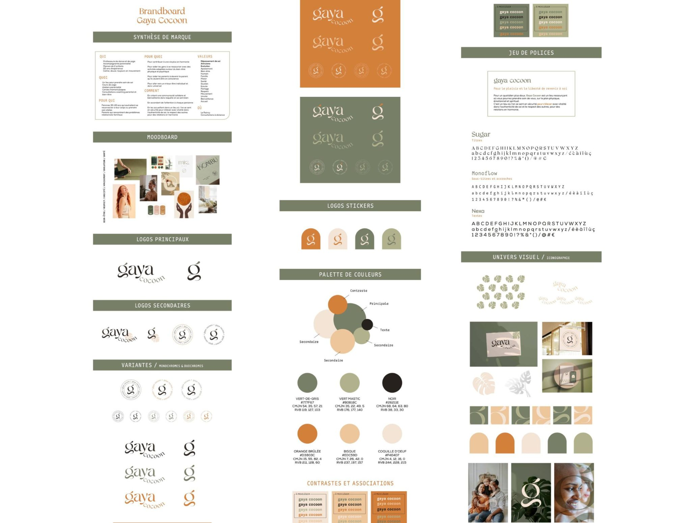
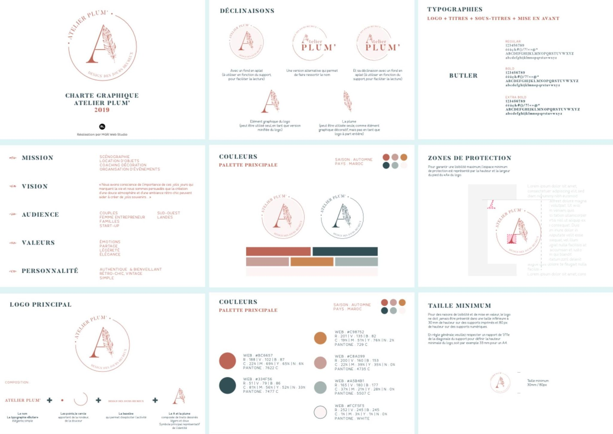

**Charte Graphique:** La charte graphique du portfolio est définie comme suit :

**Police:** Roboto. https://fonts.google.com/specimen/Roboto

**Couleurs:** Utilisation des couleurs suivantes :

#777F67: couleur principale

#B0B18C: couleur secondaire

#26211E: texte

#D3803C: contraste

#EDC59D: couleur secondaire

##F4E4D7: couleur secondaire

---
Inspiration:

(Source: https://audacieuses-creatives.com/wp-content/uploads/2023/11/brandboard-1-2048x1554.jpg)

---
Une autre idée:

Couleurs: 

#BC6657: couleur principale

#334F56: couleur principale

#C98752: couleur secondaire

#CBA099: couleur secondaire

#A5B4B1: couleur secondaire

#FCF5F5: couleur secondaire

---
Inspiration:

(Source: https://audacieuses-creatives.com/wp-content/uploads/2023/11/exemple-charte-graphique-2048x1451.jpg)

---
