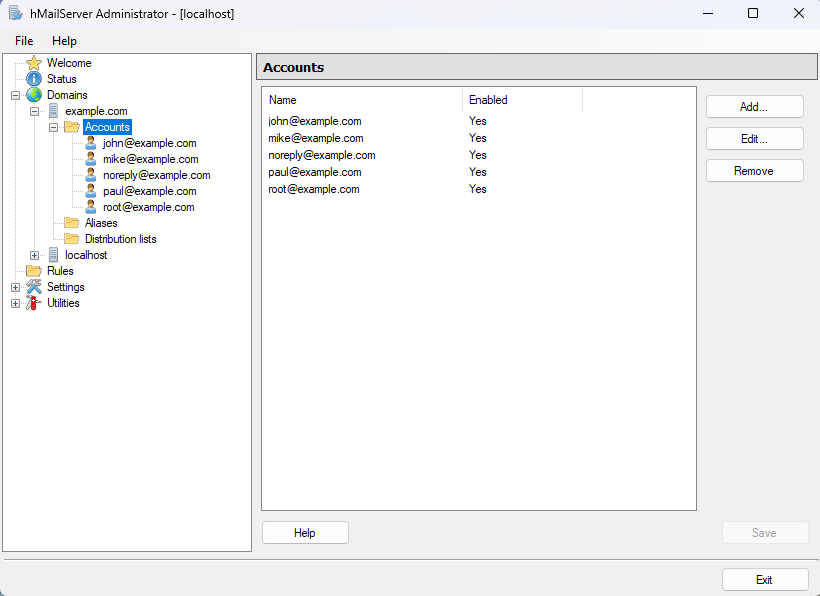
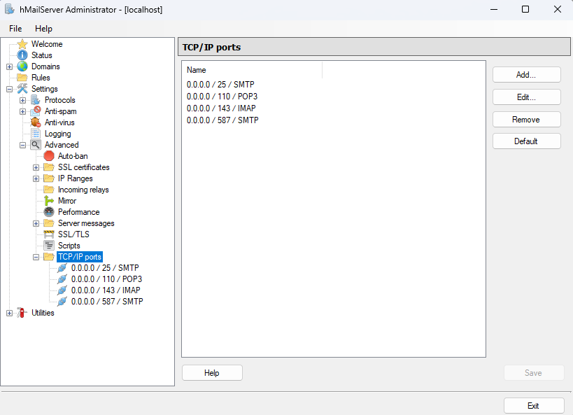

# Système de réservation en ligne pour événements avec calendrier

## Source du sujet
https://github.com/yugmerabtene/FISE-ESIEA-WEBDEV-2025/blob/main/TP/TP-03-SYS-RESERV-CAL.md


## Mise en place d'un serveur mail local (hMailServer) pour simuler la réception du mail de confirmation de compte

Ajout du domaine "example.com" et des utilisateurs:


Configuration des ports SMTP (587) et IMAP (143):



## Configuration de Mozilla Thunderbird comme client mail

Account Settings > Account Actions > Add Mail Account > Configure manually


Puis cliquer sur Re-test pour vérifier la configuration.


## Création de la base de données sur le client HeidiSQL par exemple

Voici le schéma de la base de données réalisé avec le logiciel "Looping":


Le code SQL relatif à la création de la base de données se trouve dans le fichier 1-Fichiers du site web/SQL requests/Requêtes.SQL.
En voici une copie:

```sql
-- Base de données MySQL --
CREATE DATABASE reservation_system;
USE reservation_system;


CREATE TABLE users (
    id INT AUTO_INCREMENT PRIMARY KEY,
    nom VARCHAR(50) NOT NULL,
    prenom VARCHAR(50) NOT NULL,
    date_naissance DATE NOT NULL,
    adresse VARCHAR(255) NOT NULL,
    telephone VARCHAR(15) NOT NULL,
    email VARCHAR(100) NOT NULL UNIQUE,
    password VARCHAR(255) NOT NULL,
    email_verifie BOOLEAN DEFAULT FALSE
);


CREATE TABLE reservations (
    id INT AUTO_INCREMENT PRIMARY KEY,
    user_id INT NOT NULL,
    date_heure DATETIME NOT NULL,
    FOREIGN KEY (user_id) REFERENCES users(id) ON DELETE CASCADE
);


-- Insertion de test --
INSERT INTO users (nom, prenom, date_naissance, adresse, telephone, email, password, email_verifie) VALUES
('Dupont', 'Jean', '1990-05-14', '10 rue de Paris, 75000 Paris', '0601020304', 'jean.dupont@example.com', 'hashedpassword123', TRUE),
('Martin', 'Sophie', '1985-07-21', '5 avenue des Champs, 75008 Paris', '0612345678', 'sophie.martin@example.com', 'hashedpassword456', TRUE);


INSERT INTO reservations (user_id, date_heure) VALUES
(1, '2025-02-15 10:00:00'),
(2, '2025-02-16 14:30:00'),
(3, '2025-02-17 09:00:00'),
(1, '2025-02-18 11:15:00'),
(4, '2025-02-19 16:00:00'),
(2, '2025-02-20 13:45:00'),
(5, '2025-02-21 08:30:00'),
(3, '2025-02-22 15:00:00'),
(1, '2025-02-23 12:00:00'),
(4, '2025-02-24 10:45:00');


-- Ajout de la vérification par email --
ALTER TABLE users ADD COLUMN email_token VARCHAR(255) DEFAULT NULL;


-- Suppression d'une ligne du tableau --
#DELETE FROM users WHERE id>3

-- Changement d'une ligne du tableau --
#UPDATE users SET PASSWORD='$2y$12$Up09MSmnknQsUfyFl8oHtuG4gwHe3Kc6DFCw5MraMJYK2Zrp/cvTu' WHERE id=1


-- Sélection des utilisateurs et réservations --
USE reservation_system;
SELECT * FROM users;
SELECT * FROM reservations;
```

## Screenshots du site web

### Page d'accueil du site


### Page d'inscription


### Page de connexion


### Page du profil


### Page de contact


## Améliorations possibles

- Utiliser le chiffrement pour sécuriser la connexion entre le client et le serveur mail en configurant un certificat SSL sur hMailServer.
- S'assurer que la protection contre les attaques XSS, CSRF et injections SQL est présente partout sur le site
- Ajout d'une page de politique de confidentialité et respect du RGPD
- Acheter un nom de domaine et mettre le site en ligne
